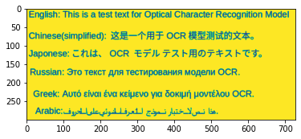

<div style="position: absolute; top: 0; right: 0;">
    <a href="ertugrulbusiness@gmail.com"></a>
    <a href="https://tr.linkedin.com/in/ertu%C4%9Fruldemir?original_referer=https%3A%2F%2Fwww.google.com%2F"></a>
    <a href="https://github.com/ertugruldmr"></a>
    <a href="https://www.kaggle.com/erturuldemir"></a>
    <a href="https://huggingface.co/ErtugrulDemir"></a>
    <a href="https://stackoverflow.com/users/21569249/ertu%c4%9frul-demir?tab=profile"></a>
    <a href="https://medium.com/@ertugrulbusiness"></a>
    <a href="https://www.youtube.com/channel/UCB0_UTu-zbIsoRBHgpsrlsA"></a>
</div>

# Custom Optical Character Recognition
 
## __Table Of Content__
- [__Abstract__](#abstract)
- [__Demo__](#demo) -> [Live Demo](https://ertugruldemir-tesseractocr.hf.space)
- [__Explanation of the study__](#explanation-of-the-study)
  - [__(A) Dependencies__](#a-dependencies)
  - [__(B) Dataset__](#b-dataset)
  - [__(C) Deployment as web demo app__](#c-deployment-as-web-demo-app)
- [__Connection Links__](#connection-links)

## Project Description
- Pytesseract OCR model implementation app.

### Abstract
- Implementation of pretrained models OCR models from python tesseract library. The goal is solving the character regonition problem from image data using through tesseract models deep learning algorithms .The study includes creating the environment, getting the data, preprocessing the data, type casting, scaling the pixel values, resizing, transposing, encoding, configurating the dataset, saving the results, deployment as demo app. The OCR models can recognize different language characters according to selected option such as Chinese, Russian, etc... Created a demo at the demo app section and served on huggingface space.  


### File Structures

- File Structure Tree
```bash
├── demo_app
│   ├── app.py
│   └── Examples
├── docs
│   └── images
├── env
│   └── env_installation.md
├── readme.md
└── study.ipynb
```
- Description of the files
  - demo_app/
    - Includes the demo web app files, it has the all the requirements in the folder so it can serve on anywhere.
  - docs/
    - Includes the documents about results and presentations
  - env/
    - It includes the training environmet related files. these are required when you run the study.ipynb file.
  - LICENSE.txt
    - It is the pure apache 2.0 licence. It isn't edited.
  - readme.md
    - It includes all the explanations about the project
  - study.ipynb
    - It is all the studies about solving the problem which reason of the dataset existance. 
  - requirements.txt
    - It includes the library dependencies of the study.   

#### __Demo__

<div align="left">
  <table>
    <tr>
    <td>
        <a target="_blank" href="https://ertugruldemir-tesseractocr.hf.space" height="30">[Demo app] HF Space</a>
      </td>
      <td>
        <a target="_blank" href="https://colab.research.google.com/drive/1ejhIyCW4Kckm8zs-1easmV1H9VlYcrrq">[Demo app] Run in Colab</a>
      </td>
      <td>
        <a target="_blank" href="https://github.com/ertugruldmr/tesseractOCR/blob/main/study.ipynb">[Traning pipeline] source on GitHub</a>
      </td>
    <td>
        <a target="_blank" href="https://colab.research.google.com/drive/18Lzlr4uCZ_-MEVZb6_odL-73UUtsvl7e#scrollTo=2HHoU0TwYc-N">[Traning pipeline] Run in Colab</a>
      </td>
    </tr>
  </table>
</div>


- Description
    -  __recognite character__ from image data.
    - __Usage__: 
      - upload your text then clict the button for extraction
- Embedded [Demo](https://ertugruldemir-tesseractocr.hf.space) window from HuggingFace Space
    

<iframe
	src="https://ertugruldemir-tesseractocr.hf.space"
	frameborder="0"
	width="850"
	height="450"
></iframe>

### Explanation of the Study
#### __(A) Dependencies__:
  - There is a third-part dependency which is pytesseract library and its requirements. You can create an environment via env/requirements.txt. Create a virtual environment then use hte following code. It is enough to satisfy the requirements for runing the study.ipynb which training pipeline.
  - Dataset can download from huggingface dataset.
#### __(B) Dataset__: 
  - Example Data
      <div style="text-align: center;">
       
      </div>

#### __(C) Deployment as web demo app__: 
  - Creating Gradio Web app to Demostrate the project.Then Serving the demo via huggingface as live.
  - Desciption
    - Project goal is recogniting characters from given image.
    - Usage: upload your image for character recognition then use the button to predict.
  - Demo
    - The demo app in the demo_app folder as an individual project. All the requirements and dependencies are in there. You can run it anywhere if you install the requirements.txt.
    - You can find the live demo as huggingface space in this [demo link](https://ertugruldemir-tesseractocr.hf.space) as full web page or you can also us the [embedded demo widget](#demo)  in this document.  

<h1 style="text-align: center;">Connection Links</h1>

<div style="text-align: center;">
    <a href="ertugrulbusiness@gmail.com"></a>
    <a href="https://tr.linkedin.com/in/ertu%C4%9Fruldemir?original_referer=https%3A%2F%2Fwww.google.com%2F"></a>
    <a href="https://github.com/ertugruldmr"></a>
    <a href="https://www.kaggle.com/erturuldemir"></a>
    <a href="https://huggingface.co/ErtugrulDemir"></a>
    <a href="https://stackoverflow.com/users/21569249/ertu%c4%9frul-demir?tab=profile"></a>
    <a href="https://www.hackerrank.com/ertugrulbusiness"></a>
    <a href="https://app.patika.dev/ertugruldmr"></a>
    <a href="https://medium.com/@ertugrulbusiness"></a>
    <a href="https://www.youtube.com/channel/UCB0_UTu-zbIsoRBHgpsrlsA"></a>
</div>

